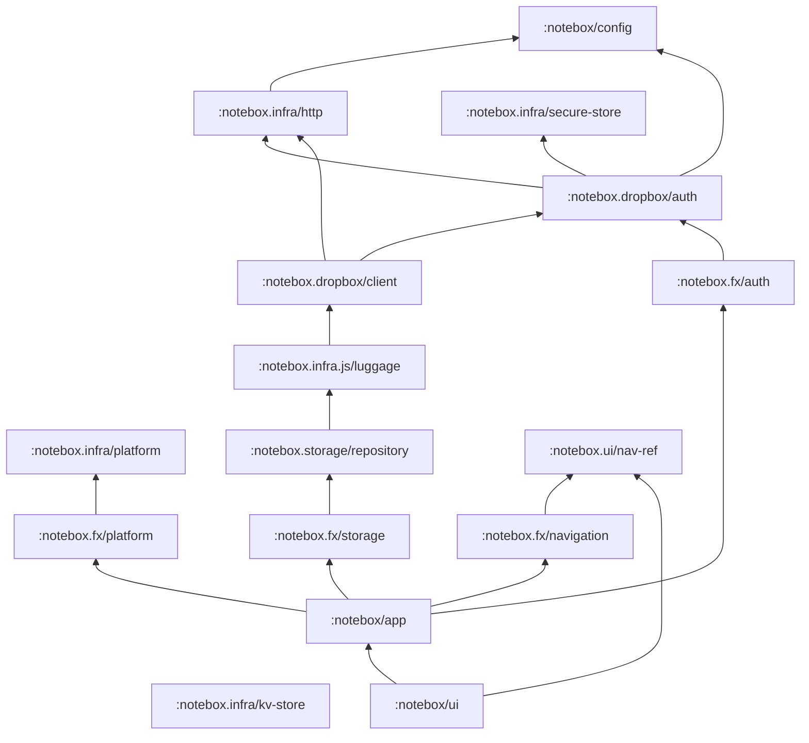

# Notebox Mobile — Roadmap

Port of the Notebox web app (`../notebox`, shadow-cljs + Reagent + re-frame + Integrant) to
React Native, written in ClojureScript and built with Krell.

- **Mandatory:** re-frame for all application state and logic.
- **Adopted:** Integrant for the component system. It works on Krell + Hermes; see
  [§4](#4-feasibility-experiments-done).
- **Hard rule:** no circular dependencies, neither between Integrant components nor between
  modules or features ([§5.2](#52-dependency-rules-no-cycles)).
- **Compatibility:** the Dropbox data format stays byte-compatible with the web app (and the
  desktop app), so all clients can share one Dropbox.

---

## 1. What the web app does (functional inventory)

| Area | Behaviour |
|---|---|
| **Auth** | "Connect Dropbox": OAuth *implicit grant* (Dropbox SDK v4 `getAuthenticationUrl`) → `/auth#access_token=…` → token stored in `sessionStorage`. On `expired_access_token`/`invalid_access_token` it redirects to Dropbox again. Logout removes the token and clears `notes-info`. User name and email come from `users/get_current_account`. |
| **Library (notes list)** | Shows "N books, M notes". Books are collapsible; expanding one lazily downloads that book's file and remembers it as the *last active book*. Notes show title or "No title" and text or "No additional text". |
| **Note view** | Book title (link back), title, text, tags, "Edit". Opening a note URL directly lazily loads its book. |
| **Create note** | Pick a book (defaults to last active, else first) or type a new book name inline ("+ Add new book"); title, text, and a multi-select tag input that can create tags, with suggestions from *all* tags across all books. The slug is a `nano-id(10)` and `created-at` is an ISO string. |
| **Edit note** | Same form, plus moving the note to another existing book or to a new book, and "Delete" with confirmation. Sets `updated-at`. |
| **Books (Notebooks)** | Table of title + count, inline rename, delete (with confirm), add new book. |
| **Search** | Debounced (500 ms) substring search, case-insensitive, over `title`, `tags`, `text` across **all** books. Books not yet downloaded are fetched on demand, and results stream in per book. A clear button resets it. |
| **Feedback** | A global "data updating…" spinner while any sync source is active. Flash messages: notice 5 s, error 10 s. |
| **Empty and error states** | Empty library → "Add a new note"; unknown note → "Note was not found"; 404 page. |
| **Static pages** | Landing/home, about, about-us, privacy policy, how-it-works, desktop-app. |

Mobile parity scope: everything above except the marketing pages. Privacy policy and about
become links or a simple screen; the web landing page becomes the login screen.

### 1.1 Additions from the mobile design

The Figma mobile design ([§8](#8-ui-and-navigation)) goes beyond web parity in a few places:

| Area | Design behaviour | Web app today |
|---|---|---|
| **Library navigation** | Drill-down: books list → one book's notes → note. No expandable books. | Collapsible books on one page |
| **Scoped search** | The home search covers notes, tags *and book titles*; the book screen searches only that book; the Books screen filters book titles. | One global search over notes |
| **Default book** | One book is marked "Default" on the Books screen and preselected in "New Note". Stored **on the device** (kv-store), not in Dropbox; falls back to the last active book, then the first book. | Implicit "last active book" |
| **Tags screen** | All tags with note counts (read-only in v1; tapping a tag searches for it). The design's "Rename", "ADD TAG" and "Create new tag" are **dropped for v1** ([§11](#11-open-questions)). | None; tags exist only on notes |
| **Tag chips** | In the editor, a tag is removed with × on its chip and added with "+ Add tag". | `react-select` multi-select |

These are in scope for v1. The design is **light-only**, and so is v1.

---

## 2. Web app architecture (as-is)

### 2.1 Structure

```
notebox.core              ig/init of resources/config.edn (read at compile time by a macro, #env/#json readers)
notebox.module.<m>        Integrant component: init-key/halt-key! that only dispatch-sync [::init]/[::halt]
notebox.module.<m>.events / effects / queries / subs / utils
notebox.page.<p>          defmethod router-views/page :route/<p>
notebox.fragment.<f>      reusable view pieces (sidemenu, notes-list, search, syncing, flash)
```

Good patterns to keep:
- **`queries` namespaces**: pure `db → value` and `db → db` functions, reused by both events and subs.
- **Feature modules** with the `events/effects/subs` split.
- **Optimistic UI updates** with a global `syncing?` map keyed by source.
- **Effect args carry callback event ids** (`:dispatch`, `:dispatch-error`), so effects don't hard-code events.

### 2.2 Integrant graph in the web app

```
router ◄── auth ◄── app ──► notes
   ▲                 │
   └─────────────────┘        messaging (standalone)
```

The Integrant graph itself is acyclic (Integrant refuses cycles), but it's mostly decorative.
`auth` ignores its `:routes` ref and `app` ignores `:auth`/`:router`/`:notes`. Components don't
hand each other values; they only dispatch init/halt events. The real coupling goes through the
global re-frame registry and namespace requires, and there **the module graph is circular**:

| Cycle | How |
|---|---|
| **app ↔ notes** | The `app` component refs `notes`, and `app.events` requires `notes.events`; but `notes.events` requires `app.effects`, because every Dropbox effect lives in the *app* module. |
| **auth ↔ notes** | `notes.events` requires `auth.events`/`auth.queries` (token, refresh-token); `auth.events` requires `notes.queries` (logout clears notes-info). |
| **router ↔ everyone** | `router.utils/path-for` does `@(re-frame/subscribe …)` and is called *inside event handlers* (`notes.events`, `auth.events`), so pure handlers depend on live router state through a global. `auth.utils` requires `router.utils` and reads `js/location`. |
| **router as event bus** | Data loading is triggered by "route watchers" (`re-frame/add-post-event-callback`) registered by `app` and `auth`. That's implicit control flow: what an event causes isn't visible in the handler. |

The namespace graph compiles only because each cycle runs through *different* namespaces of
the two modules (for example `app.events → notes.events → app.effects`).

---

## 3. Saving mechanism and Dropbox (deep dive)

### 3.1 On-disk format (must be preserved)

The web app (app key `2t7xyn3a902rv0z`) and the desktop app (`yeo22moig39n8c0`) use different
Dropbox app keys but **share the same data**: both resolve `/notes/...` to the same location.
Mobile uses the web's key ([§7](#7-auth-design)), so it sees the same `/notes` folder.

```
/notes/.meta.json
{
  "collectionsList": ["k3J9aZ0qLx", ...],                 // maintained by Luggage `create`
  "notesInfo": [{"slug": "k3J9aZ0qLx", "title": "Inbox", "count": 3}, ...],   // display order
  "tagsInfo":  {"k3J9aZ0qLx": ["work", "ideas"], ...}     // per-book distinct tags
}

/notes/<book-slug>.json
[
  {"slug": "Vh2xQ1...", "title": "...", "text": "...", "tags": ["..."],
   "created-at": "2021-01-01T00:00:00.000Z", "updated-at": "..."}   // updated-at only after edit
]
```

- Book and note slugs are `nano-id` with 10 characters.
- The key names are literal: `created-at` and `updated-at` are hyphenated, because they come
  from `clj->js` of Clojure keywords.
- `notesInfo[].count` and `tagsInfo` are *denormalized* copies computed by the client.
- The desktop app (`../notebox-desktop/src/luggage/collections.clj`) reads and writes the same
  layout.
- **Serialization (implemented in Phase 1, `notebox.domain.json`):** the web writes
  `JSON.stringify` output: compact, raw UTF-8, `/` unescaped, control characters as `\u00xx`
  (lowercase hex), lone surrogates as `\udxxx`. Key order varies per note, because the web merges
  edits with `Object.assign` (existing keys stay put, new ones such as `updated-at` are
  appended). Mobile keeps every object's key order: objects decode to array maps, and
  `notebox.domain.ordered` appends new keys instead of letting a >8-key map turn into a hash
  map. So unchanged data is written back byte-for-byte. Two documented exceptions:
  - integer-like keys (`"42"`) are ordered first, as every JS client does;
  - the desktop (Cheshire/Jackson) writes control characters with uppercase hex (`\u001B`).
    Mobile reads it fine and writes it back lowercase.

### 3.2 How Luggage (`@luggage/core` 2.2.2) writes

Every operation is a whole-file **read-modify-write** with `mode: overwrite` and **no revision
check**:

| Luggage call | Dropbox requests |
|---|---|
| `collections("notes").readMetaProperty(p, default)` | download `.meta.json` (a missing file returns `{}`) |
| `writeMetaProperty(p, v)` | download `.meta.json` → set key → upload (overwrite) |
| `create(slug)` | upload `[]` to `<slug>.json` → download meta → append to `collectionsList` → upload meta |
| `getInstance(slug).read()` | download `<slug>.json` (a missing file returns `[]`) |
| `.add(note)` | download book → push → upload |
| `.find({slug}).update(note)` | download book **twice** → find the index by *deep-equality* → `Object.assign` → upload |
| `.find({slug}).delete()` | download book twice → find the index by deep-equality → `splice` → upload |
| `getInstance(slug).delete()` | `files/delete_v2` on the book file only |

### 3.3 Web app save flows

Every flow first applies an **optimistic** `app-db` update, then chains Dropbox calls via
re-frame events, and finally rewrites `notesInfo` and then `tagsInfo`. Those two are written
**from the in-memory app-db snapshot**: 2 downloads plus 2 uploads of the meta file.

| User action | Dropbox sequence |
|---|---|
| Add note, existing book | `add` → write meta (notesInfo, tagsInfo) |
| Add note, new book | `create(nano-id)` → `add` → write meta with a new `{slug,title,count:1}` |
| Edit note, same book | `find/update` → write meta → re-fetch the book |
| Move note to an existing book | `add` to the target → `find/delete` in the source → write meta → re-fetch the target |
| Move note to a new book | `create` + `add` → `find/delete` in the source → write meta → re-fetch |
| Delete note | `find/delete` → write meta → re-fetch the book |
| Add book | `create` → write meta (`count: 0`, empty tags) |
| Rename book | write meta only |
| Delete book | delete the book file → write meta |

### 3.4 Hazards found (to fix in mobile, not to copy)

*Since Phase 3 (Luggage, [§6.3](#63-storage-through-luggage-l1)), mobile fixes 2–10 and
**accepts 1**, as the web and desktop clients do.*

1. **Lost updates across devices.** Overwrites without a `rev` are last-writer-wins. Two clients
   adding notes to the same book at the same time silently drop one note.
2. **Meta clobbering.** `notesInfo` and `tagsInfo` are uploaded from a client snapshot, so a stale
   client erases books, renames and counts made elsewhere.
3. **Index -1 bugs in Luggage.** If the note can't be found (edited or deleted elsewhere, or a
   deep-equal mismatch), `update` writes `data[-1]`. That's a silent no-op that still reports
   success. `delete` calls `splice(-1, 1)` and **deletes the last note in the book**.
4. **`collectionsList` drift.** Book delete never removes the slug from `collectionsList`.
5. **Counts and tags drift.** These are denormalized values maintained by increment/decrement,
   not derived from content.
6. **No rollback.** On a failed write the optimistic state stays, so the UI diverges from Dropbox
   until a reload. The only signal is a flash message.
7. **Ambiguous "loaded" state.** "Book loaded?" is `(nil? (book db id))`, which the code itself
   comments about.
8. **Mixed key types in `tagsInfo`.** It's keyed by keyword after a fetch but by string after
   `add-book` in memory.
9. **Short-lived tokens with no refresh.** The implicit grant's short-lived token means a full
   re-login whenever it expires.
10. **Wasteful requests.** Each meta write is 2 sequential RMW cycles, and each `find` downloads
    the book twice.

---

## 4. Feasibility experiments (done)

I ran these in an isolated copy of this project; nothing was left behind. Stack: ClojureScript
1.12.145, Krell 0.5.4, Reagent 2.0.1, **re-frame 1.4.7**, **Integrant 1.0.1**, RN 0.87 / Hermes.

| Check | Result |
|---|---|
| Krell dev build (`:none`) with re-frame + Integrant | ✅ compiles; all 120 runtime-loaded JS files pass the RN 0.87 `hermesc` |
| Krell release build (`-O advanced`) | ✅ 312 KB single file, passes `hermesc`, and runs (Node with RN-like module semantics) |
| `ig/read-string` at runtime with `#ig/ref` (cljs uses `tools.reader.edn`) | ✅ |
| Init/halt order on the DAG config → dropbox → storage → storage-fx → app → ui | ✅ init in that order; halt in exact reverse |
| An Integrant component that registers re-frame effects closing over its deps, and `rf/clear-fx` on halt | ✅ |
| Effects calling back through event vectors carried in effect args | ✅ storage → `app-db` round trip |
| Integrant cycle detection | ✅ `ig/init` throws `Circular dependency between :exp/b and :exp/a` |
| Optimistic concurrency with `rev` (fake Dropbox) | ✅ a stale rev is rejected as `path/conflict` and the other device's data survives |
| JSON round trip keeps the `created-at` key | ✅ |
| `@luggage/core` 2.2.2 core (`build/Luggage`) with a custom backend (Phase 3 spike) | ✅ runs in Node; a Metro bundle importing only `build/Luggage` passes `hermesc` (92 KB, no Dropbox SDK) |
| Hermes ES6 classes / `!$` issue (from the 2024 article) | ✅ not present with CLJS 1.12.145, so no `sed` workaround (it would corrupt a regex in `goog/html/safeurl.js`) |

Notes:
- Integrant 1.0 in CLJS: `init`, `halt!`, `suspend!`, `resume`, `ref`, `refset`, `expand`
  (profiles) and `read-string` all work. Only `load-namespaces` and `load-hierarchy` are
  CLJ-only, so namespaces defining `init-key` methods must be required explicitly (as the web
  app already does).
- Krell hot reload re-evaluates changed namespaces and re-renders the root. It has no
  user-level hook, so reg-event/reg-sub/views refresh for free, while infrastructure changes
  need an explicit `(dev/reset)` = `ig/halt!` + `ig/init` from the REPL.
- `nano-id` in CLJS calls `js/crypto.getRandomValues`, which Hermes doesn't provide. This needs
  the `react-native-get-random-values` polyfill (2.0.0).

---

## 5. Target architecture

### 5.1 Layers

```
L0  domain      (cljc, pure)    note/book/meta model, ops, meta derivation, search, validation
L1  infra       (Integrant)     http, secure-store, kv-store, dropbox auth, dropbox client,
                                 repository (Luggage-compatible), cache, sync engine, platform
L2  fx adapters (Integrant)     register re-frame reg-fx/reg-cofx that close over L1 components
L3  features    (re-frame)      events/subs/queries per feature, pure; registered at ns load
L4  ui          (Reagent)       screens (subscribe + dispatch) over pure presentational views
L5  shell       (Integrant)     :notebox/app (boot), :notebox/ui (root view, navigation container)
```

Each layer may depend only on layers *below* it. L1 knows nothing about re-frame. L3 knows
nothing about Dropbox, HTTP or React Native; it only emits effect maps.

### 5.2 Dependency rules (no cycles)

1. **Integrant refs point downward only.** Integrant itself refuses cycles (verified). If two
   components need each other, extract the shared piece into a lower component (see
   `:notebox.ui/nav-ref` below).
2. **Features never require another feature's `events` namespace.** Cross-feature interaction
   goes only through:
   - shared L0 domain functions;
   - effects provided by L2, such as `:toast/show` and `:nav/navigate`, which every feature can
     emit;
   - event ids that L2/L5 *configuration* passes as data, for example
     `:on-unauthorized [:auth/session-expired]` in the Integrant config instead of `storage`
     code requiring `auth.events`.
3. **Allowed feature order** (an arrow means "may require queries/subs of"):
   `messaging, nav ← auth ← library ← {editor, books, tags, search} ← shell`.
   Logout no longer reaches into notes; it dispatches `:app/reset-session`, owned by the
   **shell**, which resets `app-db` to the initial state and clears the cache.
4. **Event handlers are pure.** No `subscribe`/deref inside handlers (the web's
   `router-utils/path-for` pattern). Navigation is data: `{:nav/navigate [:note {:book-id .. :id ..}]}`.
5. **No route watchers or post-event callbacks.** Screens dispatch explicitly on focus, for
   example `[:library/note-screen-opened book-id note-id]`, so causality is visible in handlers.
6. **Enforcement.** `scripts/check_deps.clj` (`npm run check:deps`, part of `verify`) classifies
   every namespace into its layer and checks each require against an allowlist per layer, the
   feature order above, and cycles. String requires (`["react-native" …]`) are included.
   *(Changed in Phase 0: the plan was clj-kondo's `:discouraged-namespace`, but it can't express
   "only the subs of a lower feature", and tools.namespace gives the cycle check for free.
   clj-kondo still runs for general linting.)* `notebox.lint-rules-test` proves the rules bite.
7. **JavaScript stays at the edges.** Only these namespaces may require a JS module (a string
   require such as `["react-native" …]` or `["@luggage/core/…" …]`):
   - `notebox.infra.js.*`: JS libraries (Luggage);
   - `notebox.infra.rn.*`: React Native native modules (Keychain, Linking);
   - `notebox.ui.*`: React Native components;
   - `notebox.core`: the startup polyfill.
   Each interop namespace converts to and from ClojureScript data at its boundary, so everything
   else is plain CLJS. JS globals (`js/fetch`, `js/Promise`) are allowed. Enforced by
   `check_deps.clj`, with a violation fixture.

### 5.3 Integrant system



Sketch of the config (CLJS data or EDN read with `ig/read-string`; both verified):

```clojure
{:notebox/config               {:dropbox {:app-key "…" :redirect-uri "notebox://oauth"}
                                :collections "notes"}
 :notebox.infra/http           {:timeout-ms 20000}
 :notebox.infra/secure-store   {:service "notebox"}               ; Keychain/Keystore
 :notebox.infra/kv-store       {:prefix "notebox/"}               ; AsyncStorage
 :notebox.infra/platform       {}                                  ; NetInfo, AppState, Alert
 :notebox.dropbox/auth         {:config #ig/ref :notebox/config
                                :http #ig/ref :notebox.infra/http
                                :secure-store #ig/ref :notebox.infra/secure-store}
 :notebox.dropbox/client       {:http #ig/ref :notebox.infra/http
                                :auth #ig/ref :notebox.dropbox/auth}
 :notebox.storage/repository   {:client #ig/ref :notebox.dropbox/client :root "notes"}
 :notebox.storage/cache        {:kv #ig/ref :notebox.infra/kv-store}
 :notebox.storage/sync-engine  {:repository #ig/ref :notebox.storage/repository
                                :cache #ig/ref :notebox.storage/cache
                                :kv #ig/ref :notebox.infra/kv-store
                                :platform #ig/ref :notebox.infra/platform}
 :notebox.ui/nav-ref           {}
 :notebox.fx/auth              {:auth #ig/ref :notebox.dropbox/auth}
 :notebox.fx/storage           {:sync #ig/ref :notebox.storage/sync-engine
                                :cache #ig/ref :notebox.storage/cache
                                :on-unauthorized [:auth/session-expired]}
 :notebox.fx/navigation        {:nav-ref #ig/ref :notebox.ui/nav-ref}
 :notebox.fx/platform          {:platform #ig/ref :notebox.infra/platform
                                :on-connectivity [:sync/connectivity-changed]
                                :on-foreground   [:sync/app-foregrounded]}
 :notebox/app                  {:fx (ig/refset :notebox/fx)}       ; all :notebox.fx/* derive :notebox/fx
 :notebox/ui                   {:app #ig/ref :notebox/app :nav-ref #ig/ref :notebox.ui/nav-ref}}
```

- **Implemented (Phases 0–3):** `notebox.config` holds the real config. Profiles pick real or fake
  implementations: the `:test` and `:e2e` profiles get the in-memory Dropbox, the memory
  secure store and the fake browser. *The graph above is current; the config sketch below is
  the original plan (the kv-store, cache, sync engine and platform components were dropped in
  Phase 3).*
- **Test and dev profiles.** `#ig/profile` / `ig/expand` swap `:notebox.dropbox/client` for an
  in-memory fake Dropbox, the same fake used in the experiment. This gives offline development
  and tests without touching a real account.
- **Krell entry point.** `notebox.core/-main` does `(defonce system …)` and starts once, then
  returns `(r/as-element [(:notebox/ui @system)])`. `dev/reset` handles REPL restarts.
- **halt-key!** for fx adapters calls `rf/clear-fx` and `rf/clear-cofx`; listeners (NetInfo,
  AppState) unsubscribe.

### 5.4 Namespace layout

```
src/notebox/
  core.cljs                      ; Krell -main, system lifecycle
  config.cljs                    ; Integrant config
  domain/  note.cljc book.cljc meta.cljc ops.cljc search.cljc schema.cljc
  infra/   http.cljs secure_store.cljs browser.cljs
  infra/rn/  keychain.cljs linking.cljs            ; React Native native modules (JS interop)
  infra/js/  luggage.cljs                          ; JS libraries (JS interop): Luggage + our backend
  dropbox/ api.cljs auth.cljs client.cljs fake.cljs fake_store.cljc http.cljc errors.cljc pkce.cljc
  storage/ repository.cljs                         ; ops → Luggage reads/writes, per-file queue
  fx/      auth.cljs storage.cljs navigation.cljs platform.cljs
  feature/<f>/ events.cljs subs.cljs queries.cljs        ; f ∈ auth, library, editor, books, tags, search, messaging, sync
  ui/      theme.cljs components/… screens/… navigation.cljs root.cljs
  ui/views/…                     ; presentational components: pure (props → hiccup), no subscribe
dev/notebox/dev.cljs             ; reset, fake data seeding, (dev/check-dropbox)
test/notebox/…                   ; see §10 for the layout per test level
test/resources/fixtures/         ; anonymised /notes export (golden files), recorded HTTP responses
e2e/                             ; Maestro flows (YAML) + seed data for the :e2e profile
```

---

## 6. Storage and sync design

### 6.1 Dropbox client (L1), using `fetch` directly instead of an SDK

The Dropbox JS SDK and Luggage depend on `Blob`/`FileReader` and `node-fetch` shims. Four HTTP
endpoints are enough and are trivial over RN `fetch`:

| Function | Endpoint | Notes |
|---|---|---|
| `download path` | `content.dropboxapi.com/2/files/download` | Returns `{:data parsed-json :rev}`. `rev` comes from the `Dropbox-API-Result` response header. `path/not_found` → `{:data nil :rev nil}`. |
| `upload path data {:rev r}` / `{:mode :overwrite}` | `content.dropboxapi.com/2/files/upload` | `mode` is `{".tag":"update","update":r}` with a rev, `{".tag":"overwrite"}` with `:mode :overwrite` (what Luggage does), otherwise `{".tag":"add"}` (create without clobbering); `autorename false`. Returns the new rev. |
| `delete path` | `api.dropboxapi.com/2/files/delete_v2` | |
| `list-folder "/notes"` | `api.dropboxapi.com/2/files/list_folder` (+ `/continue`) | Revs of every book in one call, for cheap change detection. |
| `current-account` | `api.dropboxapi.com/2/users/get_current_account` | |

- The `Dropbox-API-Arg` header must be HTTP-header-safe (escape non-ASCII as `\uXXXX`).
- Errors are normalized to `{:type #{:not-found :conflict :unauthorized :rate-limited :network :server :other} …}`.
- `429`/`503` are retried after `Retry-After`.
- An access token is obtained from `:notebox.dropbox/auth` per request, with a single retry
  after a forced refresh on `401`.

### 6.2 Domain operations (L0, pure and idempotent)

Each save is described as an **op** (data). The same pure function applies it to local state and
to the freshly downloaded remote file:

```clojure
{:op :note/add    :book b :note n}       ; no-op if the slug already exists
{:op :note/update :book b :note n}       ; merge by slug, as the web's Object.assign; missing → re-add (edit wins) + :warning
{:op :note/remove :book b :slug s}       ; no-op if missing (never splice -1)
{:op :book/create :book b :title t}      ; file [] (mode add) + meta entry + collectionsList
{:op :book/rename :book b :title t}      ; meta only
{:op :book/delete :book b}               ; meta first (notesInfo, tagsInfo, collectionsList), then file
;; move = [:note/add target] then [:note/remove source]   (a duplicate on failure, never a loss)
```

`meta/refresh-book` derives `count` and `tags` for a book **from its actual content** after every
book write, and touches only that book's entries. It never rewrites the whole snapshot, and it
keeps unknown keys. This removes hazards 2, 4, 5 and 8.

### 6.3 Storage through Luggage (L1)

*Decided in Phase 3, replacing the planned sync engine: use Luggage, the abstraction the web
client and the user's other React Native apps use, and do the simplest thing.*

- **Luggage's core, our backend.** `notebox.infra.js.luggage` is the only namespace that touches
  Luggage. It imports `@luggage/core/build/Luggage` (not the package index, so the Dropbox SDK
  and its `Blob`/`FileReader` shims stay out of the app). It implements Luggage's backend
  contract in ClojureScript on top of our Dropbox client:
  - `collection(name)` → `read` / `write` / `delete` of `/<name>.json`;
  - `collections(name)` → `readMetaInfo` / `writeMetaInfo` of `/<name>/.meta.json`;
  - a missing file reads as `[]` or `{}`, as in Luggage.
  Writes upload in **overwrite** mode, exactly what Luggage's own backend does. Login, token
  refresh, retries and error types come from Phase 2. The namespace's API takes and returns
  ClojureScript data (ordered maps, see `notebox.domain.json`), never JS objects.
- **Which Luggage calls we use.** Book files: `collections.getInstance(slug).read()` / `.write(v)`.
  Meta: `readMetaProperty` / `writeMetaProperty`, one property at a time, as the web does, so
  unknown keys and properties we didn't change survive. Books: `collections.create(slug)` and
  `collections.delete(slug)`, which also keep `collectionsList` right (hazard 4). **Not**
  `find(...).update/delete`: they have the index −1 bug (hazard 3). Changes are computed by the
  Phase 1 ops and written as whole files.
- **Repository (`notebox.storage.repository`, plain CLJS).** `(apply-op! repo op)` → Promise of
  the new `{:meta :notes}`:
  1. read the book (if the op writes it) and the meta properties;
  2. `notebox.domain.ops/apply-op`;
  3. write the book file (`:write`), or `create` / `delete` it (`:create` / `:delete`);
  4. write the meta properties that changed.

  Every op writes the meta, so ops run **one at a time, in submission order** (one promise
  chain), and mobile never races itself. A failed op doesn't stop the ones after it. A
  `:book/create` also reads the book: Luggage's `create` writes `[]`, so it's only called for a
  book that isn't in `collectionsList` yet. Reads: `(load-meta repo)` and
  `(load-book repo slug)`.
- **Online only.** No outbox, no local cache, no offline mode. The meta is loaded at start and
  books when opened, as on the web, and they're kept in `app-db` for the session. A failed
  save rejects; the feature layer rolls back and shows an error.

### 6.4 Re-frame side (L3)

- An event applies the op to `app-db` optimistically (the same `ops/apply-op`) and emits
  `{:storage/apply-op {:op … :on-ok [...] :on-fail [...]}}`.
- On failure the feature **rolls back** by reloading that book and the meta from Dropbox, and
  shows a toast (hazard 6). `:unauthorized` goes to `[:auth/session-expired]`.
- `syncing?` is derived from the in-flight saves the repository reports, not ad-hoc flags.

### 6.5 Concurrency (accepted)

Every client, mobile included, writes whole files in overwrite mode. If two devices save the same
book at the same moment, the earlier save is lost (hazard 1). Mobile narrows the window
(read → change → write immediately, one op at a time) and repairs derived data: counts and tags
are recomputed from content on every write. Editing a note that was deleted elsewhere re-adds it
("edit wins", with a warning). If this ever bites, the client already supports rev-based uploads
(`{:rev r}`), and the backend could use them without changing anything above it.

---

## 7. Auth design

- **Flow.** OAuth 2 **authorization code + PKCE**, `token_access_type=offline`, with **no client
  secret in the app** (a public client) and the custom-scheme redirect `notebox://oauth`. The
  desktop app already uses PKCE + offline tokens (`../notebox-desktop/src/luggage/client.clj`).
- **Implemented in our code** (`notebox.dropbox.auth`, `.pkce`, `.http`): PKCE (Closure's
  SHA-256), the authorize URL, redirect parsing with a `state` check, and code exchange, refresh
  and revoke over `fetch`. All of it is tested in Node against a fake Dropbox server.
  *(Changed in Phase 2: `react-native-app-auth` is a legacy, non-New-Architecture native module,
  and it would own PKCE natively.)*
- **Opening the browser** is the one platform piece (`notebox.infra.browser`). v1 uses
  `Linking`: the system browser, then iOS's "Open in Notebox?" prompt for the redirect. A native
  `ASWebAuthenticationSession` module can replace it in Phase 6 without touching the auth logic.
  iOS registers the `notebox` URL scheme in `Info.plist`, and `AppDelegate` forwards it to
  `RCTLinkingManager`.
- **Storage.** The refresh token goes in Keychain/Keystore (`react-native-keychain` 10.0.0). The
  access token and its expiry stay in memory only.
- **Refresh.** `:notebox.dropbox/auth` exposes `(token!)` → Promise. It refreshes when within
  5 min of expiry via `POST /oauth2/token grant_type=refresh_token&client_id=…`, single-flight.
  `invalid_grant` means unauthorized → `[:auth/session-expired]` → login screen. The cache and
  outbox are kept, so nothing pending is lost.
- **Logout.** `POST /2/auth/token/revoke`, wipe the keychain, and `:app/reset-session` (clear the
  cache). If the outbox isn't empty, warn first.
- **App key: the web app's (`2t7xyn3a902rv0z`)**. Web and mobile are the same Dropbox app
  (decided 2026-10-03).
- **Redirect URI: `notebox://oauth`.** Dropbox accepts custom schemes only with PKCE; the
  authorization-code flow without PKCE requires `https://` or `localhost`.
- **Setup required in the Dropbox App Console** (for `2t7xyn3a902rv0z`): register the redirect
  URI `notebox://oauth`, and make sure public clients (PKCE) are allowed. The web's implicit grant
  already needs that setting.

---

## 8. UI and navigation

### 8.1 Design source

> **Local snapshot:** [`spec/design/`](design/README.md) has a screenshot of every screen, the
> exported icons, Figma's reference code with exact values, the measured tokens, and the full node
> tree. Build from it; Figma access is rate-limited (Starter plan).

Figma: [notebox](https://www.figma.com/design/zql5RT6q3vPP4GMgokSK9c/notebox?node-id=0-403),
page **"Desktop"**, section **"Notebox Mobile Application"** (`1503:454`). The mobile frames are
402 × 874 (iPhone class). The same page also has the desktop app (1020 wide), older tablet (804)
and mobile (420) variants, and the palette artboard (`0:1472`). The logo explorations are on the
"Logo" page.

| Screen | Figma node | Notes |
|---|---|---|
| Splash | `742:470` | Centered "NoteBox" logo on `bg-lighter`; reused as the native launch screen |
| Start (login) | `731:457` | Logo, "Your personal notebook in Dropbox", card "Login with your Dropbox account to get started" + **LET'S GO**. Photo background (asset to export). |
| Books home | `1502:435` | Hamburger + logo, **ADD NOTE**; search "Search notes, tags, books..."; "30 books (67 notes) in total"; book rows (icon, title, "N notes") |
| Book notes | `1506:561` | ← Back, book title, **ADD NOTE**; search "Search notes, tags..."; "16 notes in total"; note rows (bold title + 2-line text preview) |
| Note detail | `1502:483` | ← Back, truncated title, **EDIT**; book title (grey, 13), title (semibold 24), divider, body (16/24), tag chips pinned to the bottom |
| Edit note | `1502:554` | Cancel / "Edit Note" / **SAVE**; book dropdown (move), title, body, chips with × and "+ Add tag" |
| New note | `1502:519` | Cancel / "New Note" / **ADD NOTE**; "Select Notebook..." dropdown, "Enter note title...", "Add note content here...", "+ Add tag..." |
| Side menu | `0:1134` | Dark sheet: logo, account email + "dropbox account", **Log out** |
| Books (manage) | `1502:592` | Hamburger, "Books", **ADD BOOK**; "7 Books"; card per book with count, "Rename", and the default book highlighted (`cyan-lightest` + "• Default") |
| Books (variant) | `1507:685` | Older list version of the same screen with "Search books..."; take the search from here |
| Tags | `1502:658` | Hamburger, "Tags"; "5 tags in total"; card per tag (chip + "N notes"). v1 omits **ADD TAG**, "Rename" and the "Create new tag" card. |

**Not in the mobile design.** Take these from the desktop frames on the same page, or design them
as we go:
- Delete note: no affordance in "Edit note". Add a destructive action at the bottom of the
  editor or in the header, behind `:ui/confirm`.
- Delete book: "Rename" only on the Books screen. Add delete to a swipe action or the rename
  sheet.
- Empty states and 404: desktop "Empty page" (`309:365`, "No any note … ADD NOTE") and
  "Note not found" (`0:1087`), each with an illustration.
- Flash messages and the sync indicator: desktop `309:365` and `309:439`. Error =
  `bg-orange-light` + orange warning icon; success = `cyan-lightest` + check; a "data updating…"
  pill with a spinner.
- Side menu entries: the mock shows only "Log out", but the Books and Tags screens open from the
  hamburger. The menu needs Library, Books, Tags, Settings/About and Log out.
- Search results and "nothing found" states.

### 8.2 Navigation

- `@react-navigation/native` 7 + native-stack (`react-native-screens`;
  `react-native-safe-area-context` is already installed). The design uses custom dark headers
  (not native ones), so set `headerShown false` and use our own `ui.components/header`.
- Side menu: a custom side sheet (an `Animated` translate plus a backdrop) instead of the drawer
  navigator, so that Reanimated/worklets aren't required (worklets can't be authored in CLJS).
- **Stack:** Splash → Start (no session) | Library stack:
  - `:books-home` (menu root) → `:book` (notes of one book) → `:note` → `:note-edit`
  - `:note-new` (modal: Cancel / ADD NOTE)
  - `:books-manage` and `:tags` (menu roots)
  - `:settings`

### 8.3 Components

- `header`: `bg-dark`, 64 high, 16 horizontal padding. Left is the menu, back or cancel control;
  the title is centred `text-grey-light` 14 (truncated to 160); the right is a primary button.
- `primary-button`: `cyan-light` background, radius 3, 28 high, Roboto Medium 14, uppercase,
  letter spacing 0.6, `text`. A darker "commit" variant (≈ `#6CC5CF`) is used for **SAVE** in
  the editor.
- `search-input`: `bg-lighter`, radius 8, padding 12/10, 16 px search icon, placeholder
  `text-grey` 14. It sits in a white "search-and-stats" bar (padding 16, gap 12, bottom border
  `bg-light`) above a stats line (Medium 14).
- `list-row` (book or note): padding 16, separators `bg-light` 1 px, on `bg-lighter`. A book row
  has a 12 × 14 book icon, title 14, and "N notes" 12. A note row has a semibold title and a
  2-line `text-grey-dark` preview.
- `card-row` (Books/Tags manage): white/`bg-lighter` card with a `bg-light` border, radius ~6,
  and a trailing "Rename" in `text-grey`. The selected (default) card uses `cyan-lightest` with
  a `cyan` border.
- **Test ids:** write `:testID "…"` literally. Reagent would turn `:test-id` into `testId`, which
  React Native ignores, so Maestro can't find the element.
- `tag-chip`: radius 4, padding 10/6, Medium 13, `text`; background `cyan-light` (one design
  variant uses `#C3F0F5`; pick one). Editable chips get a ×. "+ Add tag" is an outlined chip that
  opens the creatable suggestion input (replaces `react-select`).
- `book-picker`: a dropdown field (`cyan-lightest` fill with a `cyan` border when set,
  "Select Notebook..." when empty) that opens a modal list plus an inline "new book".
- `toast`, `sync-indicator` (pending/unsynced), `empty-state`, and confirm dialogs through an
  `:ui/confirm` effect using `Alert`.

### 8.4 Theme

The Figma palette (`0:1472`) is identical to the web app's `../notebox/public/css/_variables.css`,
so `notebox.ui.theme` ports it one-to-one:

| Token | Value | Token | Value |
|---|---|---|---|
| `cyan` | `#3CB0BD` | `text` | `#323232` |
| `cyan-dark` | `#8ED6DE` | `text-grey-dark` | `#696468` |
| `cyan-light` | `#ADE4EA` | `text-grey` | `#888888` |
| `cyan-lightest` | `#D9F5F8` | `text-grey-slight` | `#AFAFAF` |
| `pink-dark` | `#FFC7AB` | `text-grey-light` | `#C6C6C6` |
| `pink-light` | `#FFD4BF` | `bg-dark` | `#2C292B` |
| `bg-orange-light` | `#FFE7DC` | `bg-medium` | `#696468` |
| `bg-orange` | `#FFD4BF` | `bg-light` | `#DFDFDF` |
| `bg-orange-bright` | `#FF6D26` | `bg-lighter` | `#F6F6F6` |
| `logo` (icons only) | `#6CC5CF` | `white` | `#FFFFFF` |

- **Type:** Roboto (Regular, Medium, SemiBold) with sizes 12/13/14/16/24; body text is 16 with a
  24 line height. The "NoteBox" wordmark is **Amatic SC Bold** 28, "Note" in `#6CC5CF` and "Box"
  in `text-grey-light`; render it as an SVG/PNG asset rather than bundling the font. Roboto is
  built into Android. On iOS, try bundling it (TTFs in `UIAppFonts` plus
  `react-native-asset`/manual linking); if that turns out to be a hassle, use the system font
  (SF Pro) on iOS instead. Keep the family in a single theme token so switching is a one-line
  change. One chip in Figma uses Inter; treat it as a mistake and use Roboto.
- **Spacing:** 4/8/12/16/20/24, matching the web spacers.
- **Light only.** Dark mode isn't designed and isn't planned for v1. The chrome (status bar,
  header, side menu) is dark and the content is light.
- **Assets:** exported to `spec/design/assets/` (the logo, app icon, start background, empty
  illustration and icons). Their status and caveats are in [`design/README.md`](design/README.md#assets):
  the app icon needs a full-bleed square version, the start background's white fade is drawn in
  code, and the stock photo's licence needs checking before release.

### 8.5 Mobile-specific

`KeyboardAvoidingView` in the editor, pull-to-refresh on the library, and saving drafts of an
unsaved editor to the kv-store. The status bar is light-content on `bg-dark`.

---

## 9. Phased plan

Each phase ends with a demo on a device or simulator and its **gate** passing.

**How to tell that a phase is finished.** Each phase has a gate with two parts:
- **Automated:** commands that must exit 0, plus the named test namespaces or flows that must
  exist and pass. The gate commands are cumulative: phase N also runs every earlier phase's
  checks (`npm run verify` grows as phases add tests).
- **Manual:** a short checklist, each item with the exact steps to perform it.

A phase is done only when every gate item is ticked in [`progress.md`](progress.md) with its
evidence (the date, the commit hash, and the command output summary or a screenshot path). Nothing
is ticked from memory. Re-run the gate on the final commit of the phase.

**Definition of done for any change (all phases):**
- New behaviour comes with tests at the lowest level that can see it ([§10](#10-testing-strategy)).
- A bug fix starts with a failing test that reproduces it.
- `npm run verify` is green before committing.

### Phase 0: Foundations
- **Dependencies:** add `re-frame` 1.4.7, `integrant` 1.0.1, `nano-id` 1.1.0, and
  `react-native-get-random-values` (imported first in the index; needs a custom Krell
  `krell_index.js` or a `js/require` in `notebox.core`, to be verified).
- **Test dependencies:** a `:test` alias with `lambdaisland/kaocha`, `kaocha-cloverage`,
  `org.clojure/test.check`; `day8.re-frame/re-frame-test` for the node build; clj-kondo; and
  Maestro (`brew install maestro`; it needs a JDK, which is already present for Clojure).
- **System:** `notebox.core`, `notebox.config`, `dev/reset`, with Integrant init on first `-main`;
  the Integrant profiles `:dev`, `:test` (fakes) and `:e2e` (seeded `dropbox/fake` inside the
  app).
- **Tests:** a JVM Kaocha alias for `cljc` code, a CLJS node test build (`test.edn`) with
  `day8.re-frame/test`, the clj-kondo config with layer rules
  ([§5.2](#52-dependency-rules-no-cycles)), and the scripts in [§10.2](#102-commands-packagejson-scripts-added-in-phase-0).
- **Release check:** confirm `npm run cljs:release` with `:infer-externs true`.
- **Test harness (all of [§10](#10-testing-strategy) wired up, each with one smoke test):**
  `test:clj` (Kaocha + `test.check` + Cloverage), `test:cljs` (node build with
  `day8.re-frame/test`), `lint:cljs` (clj-kondo with the layer rules), `check:deps` (namespace
  cycle check), `check:release`, `test:e2e` (Maestro), and the aggregate `verify`.
- **Gate (automated):**
  - `npm run verify` exits 0 and runs ≥ 1 test in each runner.
  - `notebox.lint-rules-test` proves that the layer rules bite: clj-kondo **fails** on
    `test/resources/lint-violations/*.cljs` (a feature requiring another feature's `events`, and
    infra requiring `re-frame`).
  - `notebox.system-test`: the test profile `ig/init`s and `ig/halt!`s cleanly, in dependency
    order.
  - `npm run check:release`: the `:advanced` build compiles, and `hermesc` accepts the output.
  - `npm run test:e2e`: the Maestro smoke flow launches the app on the iOS simulator and sees
    text rendered from a re-frame sub.
- **Gate (manual):** with the Krell REPL running, both reload paths work without restarting the app:
  - **hot reload:** edit a view's text and save → the simulator shows it immediately;
  - **`(dev/reset)`:** change the initial state (`:app/status :ready` → `:restarted` in
    `notebox.shell.events`) and save. The screen still says "ready", because hot reload doesn't
    re-run component startup or reset app-db. After `(dev/reset)` it says "Status: restarted
    (dev)". Revert both edits afterwards.

### Phase 1: Domain (L0)
- Note, book and meta schemas; ops ([§6.2](#62-domain-operations-l0-pure-and-idempotent)); meta
  derivation; search (port `matches-text`, plus matching book titles for the home search);
  slug generation; tag index (all tags → note count across books).
- **Golden tests** against a real exported `/notes` folder (anonymised), so that
  parse → apply op → serialize round-trips byte-compatible JSON (key names, order of `notesInfo`).
- **Cross-client oracle:** the desktop's `luggage/collections.clj` reads with
  `(cheshire/parse-string s true)` and writes with `generate-string`. Its code needs JavaFX and the
  Dropbox SDK, so the test runs exactly those calls with the same library version
  (Cheshire 5.10.2) in both directions. *(Revised in Phase 1; `:local/root` would pull in the
  whole desktop app.)* The web side is covered by comparing `encode` with the real
  `JSON.stringify` in Node.
- **Fixtures:** hand-written in `test/resources/fixtures/generate.mjs` (the real library is too big
  to commit). `JSON.stringify` writes the bytes, and an independent JS implementation of the op
  semantics writes each scenario's expected files.
- **Gate (automated):**
  - `npm run test:clj` passes, and Cloverage on `notebox.domain.*` reports **≥ 95 % forms**,
    enforced with `--fail-threshold`.
  - Property tests (`test.check`, ≥ 200 runs each) for every op: idempotence (applying twice =
    applying once), no-op on missing targets, meta derived from content equals meta after the
    op, and slug uniqueness.
  - The golden round-trip test is byte-identical on every fixture file.
  - The search parity table (cases taken from the web's `matches-text`) passes, including
    Cyrillic and case folding.
- **Gate (manual):** none. This phase is fully automated.

### Phase 2: Dropbox infra (L1)
- `http`, `secure-store`, `dropbox/auth` (PKCE, refresh, revoke), `dropbox/client`
  ([§6.1](#61-dropbox-client-l1-using-fetch-directly-instead-of-an-sdk)), and `dropbox/fake`
  (in-memory, with rev semantics).
- **Gate (automated):**
  - Client contract tests against a fake `fetch`: for every endpoint, the exact URL, headers
    (`Dropbox-API-Arg`), and `mode`/`rev`; plus response parsing of the responses in
    `test/resources/fixtures/http/`. *(Revised: these use the shapes Dropbox documents rather
    than recordings, because recording would copy private data from the account. The manual
    gate exercises the real API.)*
  - An error normalization table test: each HTTP status or Dropbox error maps to its `:type`;
    `429`/`503` honour `Retry-After`.
  - Auth: the PKCE verifier/challenge matches the RFC 7636 appendix B test vector; a `401`
    triggers exactly one refresh and one retry; `invalid_grant` → `:unauthorized`.
  - `dropbox/fake` passes the **same contract test suite** as the client (shared test fns), so
    the fake can be trusted in later phases.
- **Gate (manual):**
  - Log in on the simulator; `(dev/check-dropbox)` prints the account email and the parsed
    `.meta.json` of the real account.
  - `(dev/expire-token!)`, then `(dev/check-dropbox)` again: it succeeds after a logged refresh.

### Phase 3: Storage through Luggage (L1)
- `@luggage/core` 2.2.2; `notebox.infra.js.luggage` (the Luggage backend over the Dropbox client,
  with CLJS data at its edge); `notebox.storage.repository` (ops → Luggage calls, a serial
  queue per file); the client's overwrite mode; and the JS-interop dependency rule
  ([§5.2](#52-dependency-rules-no-cycles) item 7).
- **Gate (automated)**, in Node against `dropbox/fake`:
  - **Golden scenarios through Luggage:** the Phase 1 fixture folder is seeded into the fake
    Dropbox, and all 12 scenarios run through `repository/apply-op!`. The resulting files are
    byte-identical to `scenarios/*/expected`. This proves Luggage + our backend write exactly
    what the domain computes.
  - **Luggage edge cases:** missing files read as `[]` / `{}`; `create` and `delete` keep
    `collectionsList` right; unknown meta keys survive; a failed write rejects with the client's
    error type.
  - **Serial queue:** concurrent `apply-op!` calls apply one at a time in submission order (no
    lost update within mobile), and a failed op doesn't block the ones after it.
  - **Interop rule:** `check-deps` fails on a fixture that requires a JS module outside the
    interop namespaces.
- **Gate (manual):** on the simulator against the real account, from the REPL:
  - `(dev/load-meta)` and `(dev/load-book slug)` show real data through Luggage;
  - a test book: `(dev/apply-op! …)` creates it, adds a note, renames it, then deletes it; each
    step is visible in the web app, and the web app still reads the files afterwards.

### Phase 4: re-frame features (L2 + L3)
- fx adapters and features: `auth`, `library`, `editor` (add/update/move/delete), `books`
  (add/rename/delete, default book kept in the kv-store), `tags` (list with counts), `search` (lazy
  book loading, streaming results; scoped to all, one book, or book titles), `messaging`
  (toasts), `sync` (in-flight saves, rollback).
- Tag counts across *all* books need every book downloaded. The Tags screen shows counts from
  `tagsInfo` immediately (as tag names only) and fills in counts as books load, the same way
  search does.
- **Gate (automated):**
  - Every web save flow ([§3.3](#33-web-app-save-flows)) and every §1.1 addition has a
    `day8.re-frame/test` test against the test system (`dropbox/fake`), including the rollback
    and auth-expiry paths.
  - **Event coverage meta-test:** in the test profile, a global interceptor records every handled
    event id; `notebox.event-coverage-test` (run last) fails if any id registered with
    `reg-event-fx`/`reg-event-db` was never handled. The same check applies to `reg-sub`.
  - Sub tests: the derived subs (books with counts, tag index, search results, default-book
    fallback) are checked against example `app-db`s.
- **Gate (manual):** none. Features are verified through the UI in Phase 5.

### Phase 5: UI (L4 + L5)
- Navigation, the screens and components from [§8](#8-ui-and-navigation), the theme, and empty
  and error states.
- Export the Figma assets listed in [§8.4](#84-theme) and try bundling Roboto on iOS first
  (system font if that's a hassle).
- Fill the design gaps listed in [§8.1](#81-design-source) (delete note/book, empty and 404
  states, side menu entries, toasts), ideally adding them to Figma so it stays the source of
  truth.
- **Gate (automated):**
  - **View tests** (cljs node): every presentational view in `notebox.ui.views.*` renders the
    expected hiccup for its states (normal, empty, loading, error, long text and truncation),
    and its press handlers dispatch the expected events. RN components are stubbed, so no
    simulator is needed.
  - **Maestro flows** (`e2e/`, iOS simulator, `:e2e` profile with `dropbox/fake` seeded from
    `e2e/seed/`), one per journey: login → books home; open book → note; create note (default
    book preselected); edit and move a note; delete a note; search (global, in-book, and book
    titles); books add/rename/delete and set default; tags list; empty library; note not found;
    logout. `npm run test:e2e` passes.
  - Each flow saves screenshots (`takeScreenshot`) to `e2e/screenshots/` (gitignored).
- **Gate (manual):**
  - **Design review:** put each `e2e/screenshots/*.png` next to its `spec/design/screens/*.png`
    and tick it in `progress.md`. Differences must be intentional (for example a design gap we
    filled) and noted there.
  - **Parity run** on the real account (simulator), following the [§1](#1-what-the-web-app-does-functional-inventory)
    and [§1.1](#11-additions-from-the-mobile-design) tables row by row, then confirming the
    changes in the web app.

### Phase 6: Hardening and release
- **Android:** SDK and emulator setup (not installed on this machine yet), deep-link intent
  filter, and a Keystore check.
- **Release:** an `:advanced` build, Hermes bytecode in release, the app icon (Figma `0:215`)
  and the launch screen matching the Splash frame (`742:470`), the
  privacy-policy link, and error logging (optional Sentry).
- **Gate (automated):**
  - The whole Maestro suite passes on the **Android emulator** as well as on iOS.
  - `npm run check:release`, plus the Maestro smoke flow on a **release** build on both
    platforms (the `:advanced` + Hermes bytecode path, catching externs problems).
- **Gate (manual):**
  - Install the release builds on a real iPhone (and an Android device or emulator); log in to
    the real account and do one create/edit/delete round trip.
  - The icon and launch screen are checked on the device's home screen and at cold start.
  - The privacy-policy link opens; the stock-photo licence is confirmed and recorded.

### Phase 7 (post-parity, optional)
- Offline: a local cache (instant start, reading offline) and an outbox for offline saves;
  rev-based uploads to remove hazard 1. These were planned for Phase 3 and cut to keep it simple.
- Tag management (rename across books, create, delete; see the decisions in
  [§11](#11-open-questions)), tablet layouts (Figma has 804-wide variants of every screen, in
  the older style), dark mode,
  background refresh, Markdown rendering, a share extension ("save to Notebox"),
  `list_folder/longpoll` for live updates, and back-porting rev-based writes to the web and
  desktop clients.

---

## 10. Testing strategy

The web app has almost no tests; mobile is built test-first where it's cheap (domain, sync) and
test-alongside elsewhere. Correctness lives in pure code (L0 and the sync core), so most tests run
on the JVM in milliseconds, without React Native. The storage layer (Luggage is JS) is tested in
Node.

### 10.1 Levels

| Level | Runs on | Tooling | What | Location |
|---|---|---|---|---|
| Domain (cljc) | JVM | Kaocha, `clojure.test`, `test.check`, Cloverage | ops (property tests), meta derivation, search parity, schemas, golden JSON round-trip, desktop-reader oracle | `test/notebox/domain/` |
| Storage (cljs) | node | `cljs.test` + `dropbox/fake` | Luggage backend, repository, golden scenarios through Luggage, serial queue ([§6.3](#63-storage-through-luggage-l1)) | `test/notebox/storage/`, `test/notebox/infra/` |
| Infra (cljs) | node | `cljs.test` + fakes (fetch, kv, clock) | Dropbox client contract (shared with `dropbox/fake`), auth/PKCE, error mapping, sync driver | `test/notebox/dropbox/`, `test/notebox/infra/` |
| System | node | `ig/init` of the test profile | the graph is acyclic and starts and halts in order | `test/notebox/system_test.cljs` |
| Events and subs | node | `day8.re-frame/test` + test system | every flow, rollback, auth expiry; the event/sub coverage meta-test | `test/notebox/feature/` |
| Views | node | hiccup assertions, stubbed RN | every presentational view state and handler | `test/notebox/ui/` |
| End-to-end | iOS sim / Android emu | Maestro + `:e2e` profile (seeded fake Dropbox) | user journeys, screenshots for design review | `e2e/` |
| Static | JVM | `check_deps.clj` (layer rules + cycles), its self-test, clj-kondo (general lint) | the no-cycles hard rule ([§5.2](#52-dependency-rules-no-cycles)) | `scripts/check_deps.clj`, `test/resources/lint-violations/`, `.clj-kondo/` |
| Release | macOS | Krell `:advanced` + `hermesc` | the production bundle compiles and loads | `scripts/check-release.sh` |
| Manual | device | the checklists in each phase gate | real account, cross-client, kill/offline | [`progress.md`](progress.md) |

**Why these tools.** Kaocha gives one JVM runner with Cloverage and `test.check` support.
Maestro drives the RN app as a black box (YAML flows, no instrumentation of CLJS code), works on
both platforms, and takes screenshots. Presentational views are pure functions to hiccup, so they're
testable in node without a renderer. Screens (which subscribe) stay thin and are covered by
Maestro.

### 10.2 Commands (`package.json` scripts, added in Phase 0)

| Script | Does |
|---|---|
| `test:clj` | `clojure -M:test` (Kaocha: domain + sync core; Cloverage with thresholds) |
| `test:cljs` | build `test.edn` (`:target :nodejs`) and run it with node |
| `lint:cljs` | clj-kondo over `src test dev scripts` (warnings fail) |
| `check:deps` | layer rules + namespace cycles over `src dev` (`scripts/check_deps.clj`) |
| `verify` | `test:clj` + `test:cljs` + `lint:cljs` + `check:deps` + `jest` (fast; run before every commit) |
| `check:release` | `:advanced` build + `hermesc` on the output |
| `test:e2e` | `scripts/e2e.sh`: an `:advanced` build with the `:e2e` profile into `target/e2e`, `index.js` pointed at it for the run (and restored), then `maestro test e2e/flows`. Needs Metro running and the app installed. iOS by default; `E2E_PLATFORM=android` |
| `cljs:repl` | the Krell REPL, with `dev/` on the classpath (`(require '[notebox.dev :as dev])`) |

### 10.3 Test data

- `test/resources/fixtures/notes-export/`: an anonymised copy of a real `/notes` folder (the
  same text structure, Cyrillic preserved, private content replaced). Used by the golden tests
  and seeded into `e2e/seed/`.
- `test/resources/fixtures/http/`: recorded Dropbox responses (success, `409` path/conflict,
  `401` expired, `429` with `Retry-After`), recorded once in Phase 2 from the real API.
- Generators (`notebox.test.gen`): notes, books, op sequences and fault schedules, shared by the
  property and simulation tests.

---

---

## 11. Open questions

None at the moment.

**Decided (2026-10-03):**
- **Storage: Luggage**, with our backend over the Dropbox client. Overwrite semantics like the
  other clients; online only, with no cache or outbox in v1 ([§6.3](#63-storage-through-luggage-l1)).
  This also settles three earlier questions: offline scope (online only), back-porting revs to
  web/desktop (not needed), and edit vs. remote delete (edit wins + warning).
- **App key: reuse the web's** (`2t7xyn3a902rv0z`): it's the same Dropbox app. See [§7](#7-auth-design).
- **Redirect URI: `notebox://oauth`** (custom schemes work with PKCE). `db-<app-key>://` would also
  be accepted, and switching is a config change.
- **"Create new tag": dropped for v1.** The format has nowhere to store a tag without notes (tags
  live on notes; `tagsInfo` is derived from them), and tags are still created from the note
  editor, as on the web. If it comes back later, the choices are unused tags kept locally as
  suggestions, or a top-level `"tags"` key in `.meta.json` (Luggage's `writeMetaProperty` sets one
  key at a time, so web keeps unknown keys apart from the hazard-1 race; check the desktop port).
- **Tag rename: dropped for v1.** It would rewrite every affected book, and a web or desktop
  client holding a stale copy could bring the old tag back.
- **Default book: on the device** (kv-store, per device, no format change). It falls back to the
  last active book, then the first book.
- **Light-only** for v1.
- **Font:** bundle Roboto on iOS if that's simple; otherwise use the system font.

---

## 12. Risks

| Risk | Mitigation |
|---|---|
| Krell 0.5.4 is old (CLJS 1.12 needs an explicit `data.json`; it pins 2021-era native deps) | Already handled in `deps.edn`/`package.json`. Pin a Krell git SHA if a newer fix is needed. |
| Advanced compilation breaking JS interop | `:infer-externs true`, `^js` hints, and a release smoke test in CI (as in [§4](#4-feasibility-experiments-done)) |
| No `crypto.getRandomValues` on Hermes | `react-native-get-random-values` polyfill (Phase 0) |
| Other clients clobbering without a rev | Derived meta self-heals; optional back-port (Phase 7) |
| Dropbox rate limits during "search all books" | Cache plus `list_folder` revs; bounded concurrency (for example 3 parallel downloads) |
| Native modules vs RN 0.87 (New Architecture only) | Verify each library's New Architecture support before adoption (Phase 0/2) |
